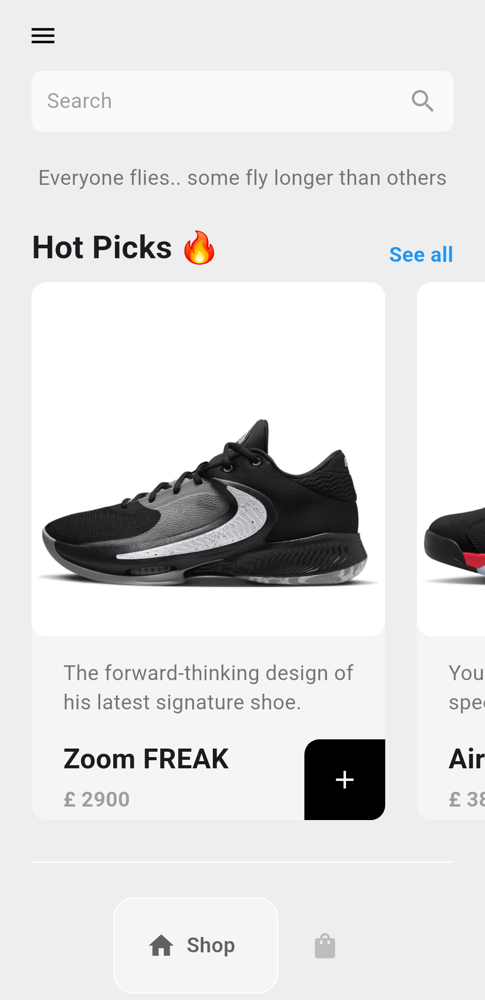
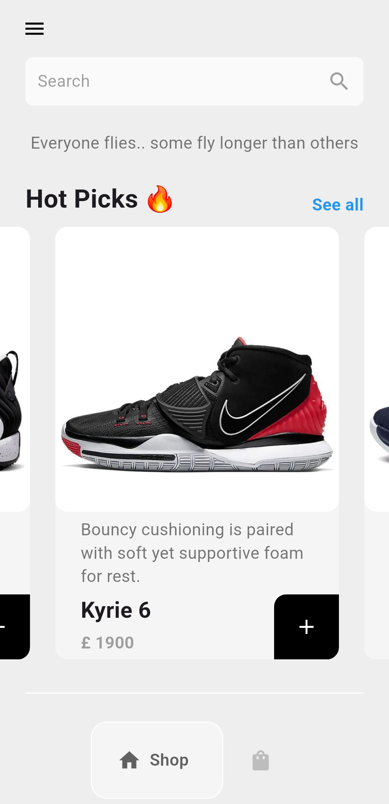
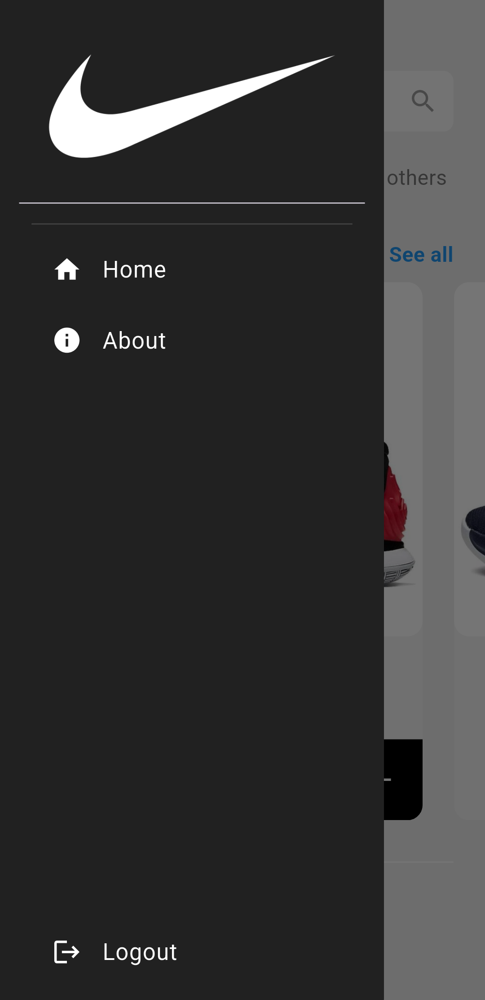
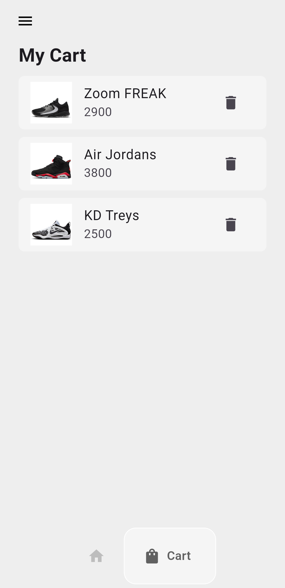

# 👟 Sneaker Shop

A modern cross-platform e-commerce application built with Flutter, featuring a clean UI, product browsing, shopping cart functionality, and responsive design.

---

## ✨ Features

- 👟 Browse sneaker collections
- 🔍 Search products
- 🛒 Add and remove items from cart
- 📦 Shopping cart management
- 📱 Responsive UI
- 🎨 Modern and minimal design
- 📂 Navigation Drawer
- 📑 Bottom Navigation

---

## 📱 Screenshots

<p align="center">
  
  
</p>

<p align="center">
  
  
</p>

<p align="center">
  
</p>

---

## 🛠 Tech Stack

- Flutter
- Dart
- Provider
- Material Design
- Custom Widgets

---

## 📂 Project Structure

```
lib/
 ├── components/
 ├── models/
 ├── pages/
 ├── services/
 └── main.dart
```

---

## 🚀 Getting Started

```bash
git clone https://github.com/AhmedSameh70/SneakerShop-Flutter.git
```

Run:

```bash
flutter pub get
flutter run
```

---

## 📌 Future Improvements

- Wishlist
- Product Details
- Payment Integration
- Dark Mode
- Order History

---

## 👨‍💻 Author

Ahmed Sameh

Mobile Application Developer